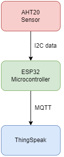

# CMIDAT01K

Hierbij de repository van Rinish Ramman (0943275) voor het keuzevak CMIDAT01K.

Voor de opdracht heb ik een AHT20 temperatuursensor uitgelezen en de data via mqtt gepost op thingspeak.

[Diagram](https://github.com/rinish2000/CMIDAT01K/blob/main/docs/Diagram.pdf)

De gehele opdracht is geschreven door middel van de PlatformIO extension binnen Visual Studio Code.
```
│   .gitignore
│   platformio.ini
├───.vscode
│       extensions.json
│       launch.json
│
├───docs
│       Diagram.pdf
│
├───src
│       main.cpp
│
└───video
        Demo-CMIDAT01K.mp4
```

## Diagram

